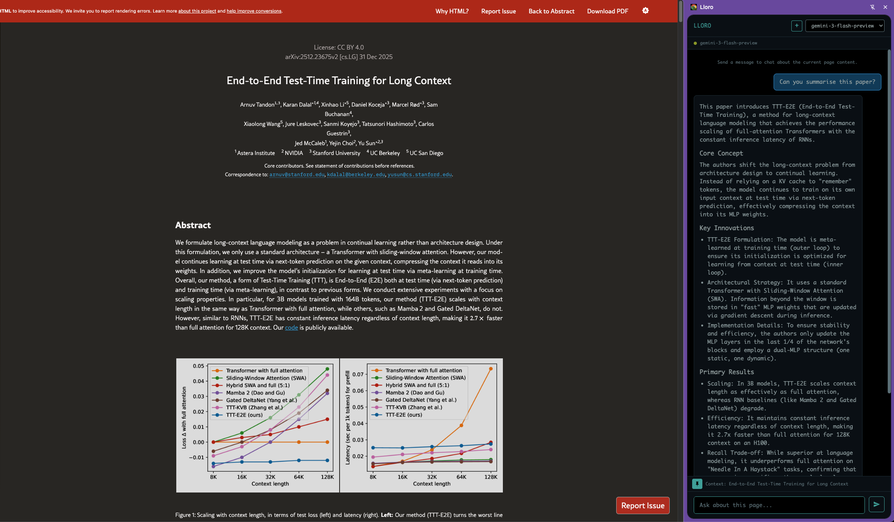

#  Lloro

Chrome Extension + Go Backend for chatting with page content using Gemini CLI via the Agent Client Protocol (ACP).

> [!WARNING]
> Don't blame me if you get prompt injected, use this at your own risk.



## Prerequisites

- Go 1.21+
- [Gemini CLI](https://github.com/google-gemini/gemini-cli) installed and authenticated
- Chrome/Chromium browser

### Gemini CLI Setup

1. Install the latest version of Gemini CLI:
   ```bash
   npm install -g @google/gemini-cli
   ```

2. Authenticate:
   ```bash
   gemini
   ```

3. (Optional) Enable Gemini 3 preview models:
   ```bash
   gemini settings
   ```
   Navigate to model settings and enable the preview models if you want access to `gemini-3-flash-preview` and `gemini-3-pro-preview`.

## Project Structure

```
ext/
├── backend/           # Go JSON-RPC server (ACP wrapper)
│   ├── go.mod
│   └── main.go
├── extension/         # Chrome extension
│   ├── manifest.json
│   ├── background.js
│   ├── side_panel.html
│   ├── main.js
│   ├── content.js
│   ├── Readability.js
│   ├── marked.min.js
│   └── icons/
└── README.md
```

## How It Works

The backend spawns `gemini --experimental-acp` as a subprocess and communicates with it using the [Agent Client Protocol](https://agentclientprotocol.com/) (JSON-RPC over stdio). This maintains a persistent session with conversation history, so you can have multi-turn conversations about page content.

Page content is extracted once per URL and sent with the first message. Subsequent messages in the same session only send the user's question.

## Setup

### 1. Start the Backend

```bash
cd backend
go run main.go
```

The server starts on `http://localhost:6363`. Endpoints:
- `POST /rpc` - JSON-RPC endpoint
- `GET /health` - Health check

### 2. Load the Chrome Extension

1. Open Chrome and navigate to `chrome://extensions`
2. Enable "Developer mode" (toggle in top right)
3. Click "Load unpacked"
4. Select the `extension/` directory

### 3. Use the Extension

1. Click the extension icon in Chrome toolbar to open the side panel
2. Select a model from the dropdown (default: gemini-3-flash-preview)
3. Navigate to any webpage
4. Type a question about the page content and press Enter
5. Use the "+" button to start a new conversation

## JSON-RPC API

### InitSession

Initializes or resets the Gemini CLI agent with a specific model.

```json
{
  "jsonrpc": "2.0",
  "id": 1,
  "method": "InitSession",
  "params": { "model": "gemini-3-flash-preview" }
}
```

### Chat

Sends a message with optional page context to the agent.

```json
{
  "jsonrpc": "2.0",
  "id": 2,
  "method": "Chat",
  "params": {
    "message": "Summarize this article",
    "context": "Page content here..."
  }
}
```

## Configuration

### Environment Variables

- `PORT` - Backend server port (default: 6363)

### Available Models

- `gemini-3-flash-preview` (default)
- `gemini-3-pro-preview`
- `gemini-2.5-flash`
- `gemini-2.5-pro`
- `gemini-2.5-flash-lite`

## Troubleshooting

### Backend shows "ACP initialize failed, falling back to non-interactive mode"

This usually means the Gemini CLI version doesn't support ACP or there's an authentication issue:
1. Update Gemini CLI: `npm update -g @google/gemini-cli`
2. Re-authenticate: `gemini`
3. Check that `gemini --experimental-acp` works in your terminal

### Backend shows "failed to start gemini-cli"

Ensure `gemini` CLI is installed and in your PATH:
```bash
which gemini
gemini --version
```

### Extension shows "Backend offline"

1. Verify the backend is running: `curl http://localhost:6363/health`
2. Check for port conflicts
3. Ensure CORS is working (check browser console for errors)

### Model not found error

If you see "ModelNotFoundError", the selected model may not be enabled:
1. Run `gemini settings` and check available models
2. Enable preview models if using Gemini 3

### Content extraction fails

Some pages block content scripts. The extension falls back to basic text extraction if Readability fails.

## Development

### Backend

```bash
cd backend
go run main.go
```

### Extension

After making changes to extension files:
1. Go to `chrome://extensions`
2. Click the refresh icon on the extension card
